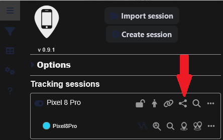
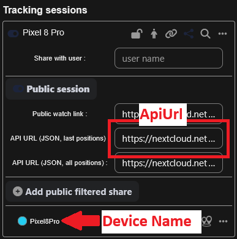

# PhoneTrack Home Assistant Integration

A Home Assistant custom component that integrates with PhoneTrack to provide device tracking capabilities.
It is inspired by [homeassistant-phonetrack by j1nx](https://github.com/j1nx/homeassistant-phonetrack), but updated and configurable via the Home Assistant UI.

## Installation

### HACS Installation
Coming soon to HACS.

### Manual Installation

1. Copy the `phonetrack` folder to your `custom_components` directory
2. Restart Home Assistant

## Configuration

### Getting the API URL from PhoneTrack

Follow these steps to obtain your PhoneTrack API URL:

1. **Open PhoneTrack**: Launch your PhoneTrack web interface
2. **Navigate to Main Tab**: Go to the main tracking view where your devices are listed
3. **Access Share Options**: Click the Share button to open sharing configuration

   

4. **Copy API URL**: Locate and copy the whole **API URL (JSON, last positions)** field and the exact device name.

   

The integration is configured through the Home Assistant UI:

1. Go to **Settings** → **Devices & Services**
2. Click **Add Integration**
3. Search for "PhoneTrack"
4. Fill in the configuration form:

### Configuration Parameters

| Parameter | Required | Default | Description |
|-----------|----------|---------|-------------|
| **API URL** | Yes | - | Full PhoneTrack API endpoint URL with token (must contain `getlastpositions`) |
| **Device Name** | Yes | - | Name of the device as reported by PhoneTrack |
| **Integration Name** | Yes | PhoneTrack | Friendly name for this integration in Home Assistant |
| **Max GPS Accuracy** | Yes | 100 | Maximum allowed GPS accuracy in meters. Updates with worse accuracy are ignored |
| **Update Interval** | Yes | 60 | How often to poll the PhoneTrack API (in seconds) |
| **Last Update Timeout** | Yes | 30 | Mark device as unavailable after this many minutes without updates |

## Support

- **Documentation**: [PhoneTrack GitHub](https://github.com/woulve/phonetrack)
- **Issues**: [Report Issues](https://github.com/woulve/phonetrack)

## License

This integration is provided as-is under the standard Home Assistant custom component terms.